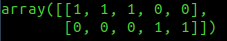

# INCREMENTAL LC-KSVD

Python implementation of the Incremental Label consistent KSVD algorithm proposed by Zhuolin Jiang, Zhe Lin and Larry S. Davis.

This implementation is a translation of the matlab code released by the authors
on [http://users.umiacs.umd.edu/~zhuolin/projectlcksvd.html](http://users.umiacs.umd.edu/~zhuolin/projectlcksvd.html).

The results on Caltech101 using 30 training samples are consistent with those reported by the [authors](http://users.umiacs.umd.edu/~zhuolin/projectlcksvd.html)

| Best recognition rate (accuracy) | Iteration |
|:-----------------------:|:-----------:|
|     0.710552268244576 |         3 |
|    0.7140039447731755 |         0 |
|    0.7284681130834977 |         1 |
|    0.7218934911242604 |         1 |
|    0.7345496383957922 |         1 |
|     0.735207100591716 |         0 |
|    0.7355358316896778 |         1 |
|    0.7373438527284681 |         0 |

## INSTALLATION

1. Create a virtual environment and activate it [optional]

2. Create your local settings.py

	``` bash
	cp settings.py.template settings.py
	```

3. Install the requirements

	`pip install -r requirements.txt`

4. You can install ATLAS or Intel MKL to work with SPAMS. The [documentation](http://spams-devel.gforge.inria.fr/doc-python/html/doc_spams003.html)
   suggests using MKL to get the best performance.

	1. Atlas:

		1. Run [this installation
    script](https://gist.github.com/giussepi/a1690eb51cc65b7b9cb534d108cc7898). Look
    at [ATLAS stable
    releases](https://sourceforge.net/projects/math-atlas/files/Stable/) and
    [LaPack releses](http://www.netlib.org/lapack/) to update the script if
    necessary.
		2. Install spams

			`pip installs spams`

	2. Intel Math Kernel Library (MKL)

		1. MKL is part of the Intel® Parallel Studio XE Cluster Edition for
    Linux. So you need to register on [its web
    site](https://software.intel.com/content/www/us/en/develop/tools/parallel-studio-xe/choose-download.html). Scroll
    down and go to the section that says "Get Your Free Software" and choose the
    option that applied to you. After the registration process you will receive
    a serial number and a download link. You must store them on a safe
    place. Finally, just download the installer and follow the steps. Finally,
    test your installation by running (the path could be a bit different):

			`source /opt/intel/parallel_studio_xe_2020/psxevars.sh`

		2. If using a virtual environment then **the above line must be executed**
           **always after activating the environment**. If you are using virtualenvwrapper
           you can place it at `<my virtualenv path>/bin/postactivate` file.

		3. Install spams for MKL

			`pip install spams-mkl`


## Development

1. For some unknown reason numpy must be imported always before spams to avoid
   the importation error `_spams_wrap.cpython-36m-x86_64-linux-gnu.so: undefined symbol: slasrt_`

   ``` python
   import numpy as np
   import spams
   ```
2. Install all your dependencies before running `source /opt/intel/parallel_studio_xe_2020/psxevars.sh`. Otherwise, you could overwrite some Intel programs and cause error like `ImportError: /home/giussepi/.local/lib/python3.7/site-packages/_spams_wrap.cpython-37m-x86_64-linux-gnu.so: undefined symbol: slasrt_`. If this happens to you, you have a good chance of fixing it by unsintalling all your dependencies by running:

	``` bash
	pip uninstall -r requirements.txt
	```
3. All the code must be called from the `main.py` file.

4. If using MKL and EMACS + ELPY, you have to run your code in the old fashion way (C-u C-c C-c will not work)

	``` bash
	python main.py
	```

## Dataset handlers

Classes implemented to manage datasets and provide the training and testing data.

### spatialpyramidfeatures4caltech101

1. Download the [caltech101 extracted spatial pyramid features](http://www.umiacs.umd.edu/~zhuolin/LCKSVD/features/spatialpyramidfeatures4caltech101.zip) and placing it in the TRAINING_DATA_DIRECTORY or create a symbolic link to its location. e.g.:

	``` bash
	cd ~/Downloads
	unzip spatialpyramidfeatures4caltech101.zip
	cd <path_to_my_project>
	mkdir trainingdata
	cd trainingdata
	ln -s /home/<myuser>/Downloads/spatialpyramidfeatures4caltech101 spatialpyramidfeatures4caltech101
	```

2. Fill the spatialpyramidfeatures4caltech101 section from your `settings.py`

3. Update the values of `CLASS_NUMBER` and `DATASET_NAME` in your `settings.py`

	``` python
	CLASS_NUMBER = 102
	DATASET_NAME = 'caltech101'
	```

4. Call the handler. If it works then you are ready to use ILC-KSVD.
   ``` python
   from utils.datasets.spatialpyramidfeatures4caltech101 import DBhandler

   train_feats, train_labels, test_feats, test_labels = DBhandler()()
   ```

### Generic Dataset Handler
In general this application works with codes and labels numpy arrays with the shape `(features, samples)`. Yes, the samples are in the columns!. Thus, codes of 300 features and 1000 samples must have the shape `(300, 1000)`; in the same way, if we are working only with two labels, then the shape of the labels must be `(2, 1000)`. In this regard, the label array is matrix full of zeros, where `label[i,j]=1` only where the sample 'j' belongs to the label 'i'. For instance, if the first 3 samples belong to label 0 and the next 2 belong to label 1, then `label[:,:5]` will look like this:



The dataset files must be JSON files containing a serialized dictionary with two keys: `codes` and `labels`.

Before applying JSON serialization the codes and labels must be like this:

``` python
'codes': [[values_row_1], [values_row_2], [values_row_3], ...]
'labels': [[values_row_1], [values_row_2], [values_row_3], ...]
```

The easiest way of achieving this using numpy arrays is:

``` python
formatted_data = {
	'codes': [[mycodes[i].tolist() for i in range(mycodes.shape[0])]],
	'labels: [[mylabels[i].tolist() for i in range(mylabels.shape[0])]]
}
```

**Using the generic dataset handler is simple:**


1. Place your dataset in the training directory (create it if it doesn't exist).

2. Fill the Generic Dataset Handler section from your `setting.py`.

3. Update the values of `CLASS_NUMBER` and `DATASET_NAME` in your `settings.py` based on your dataset. E.g.: PatchCamelion is a binary classification problem, so:

	``` python
	CLASS_NUMBER = 2
	DATASET_NAME = 'patchcamelyon'
	```

3. Call the handler. If it works then you are ready to use ILC-KSVD.

   ``` python
   from utils.datasets.generic import DBhandler

   train_feats, train_labels, test_feats, test_labels = DBhandler()()
   ```

## ILC-KSVD

Once you have your dataset handler configured and working; the initialization, training and testing  of ILC-KSVD is straightforward:

``` python
from models.ilc_ksvd import ILCksvd
from utils.datasets.spatialpyramidfeatures4caltech101 import DBhandler
# from utils.datasets.generic import DBhandler

ilc_ksvd = ILCksvd(DBhandler)
ilc_ksvd.train()
ilc_ksvd.test(plot=True)
```
Achieving the same results reported in the original paper [Label Consistent
K-SVD: Learning a Discriminative Dictionary for
Recognition](https://ieeexplore.ieee.org/abstract/document/6516503) using
spams + MKL required training the algorithm and then using another python execution
to test it. We assume that this particular behaviour is related with spams and
MKL; because the results, after running the algorithm several times during the
day, are not as good as those obtained after restarting the computer.
